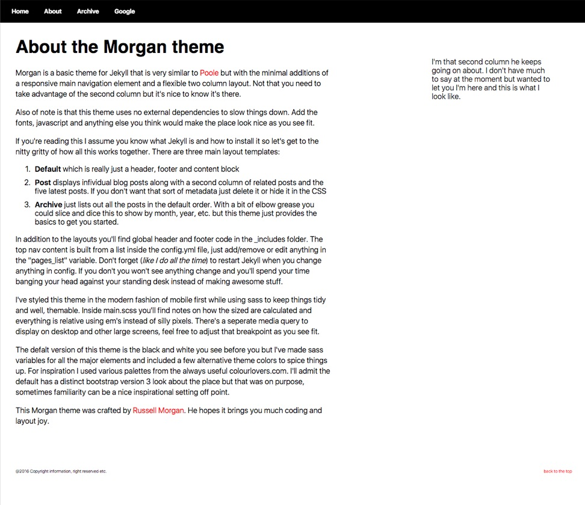
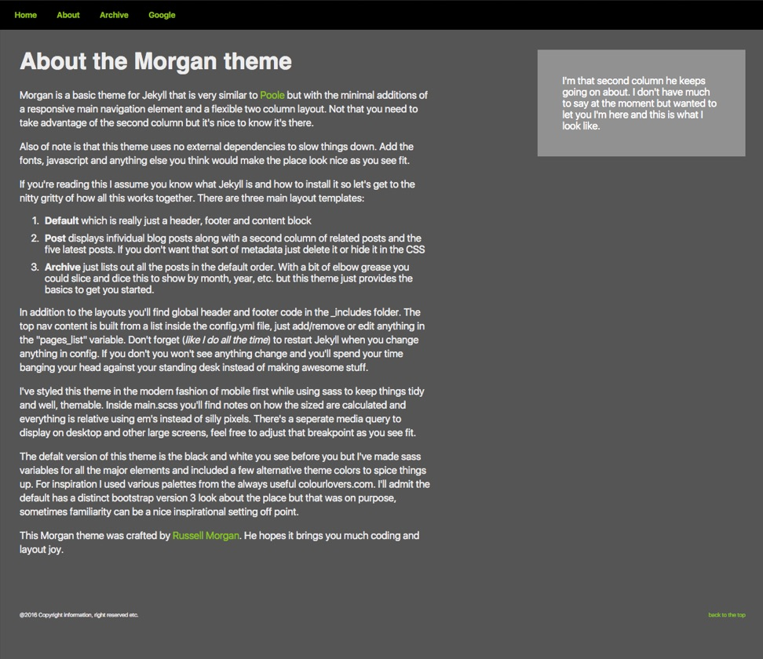
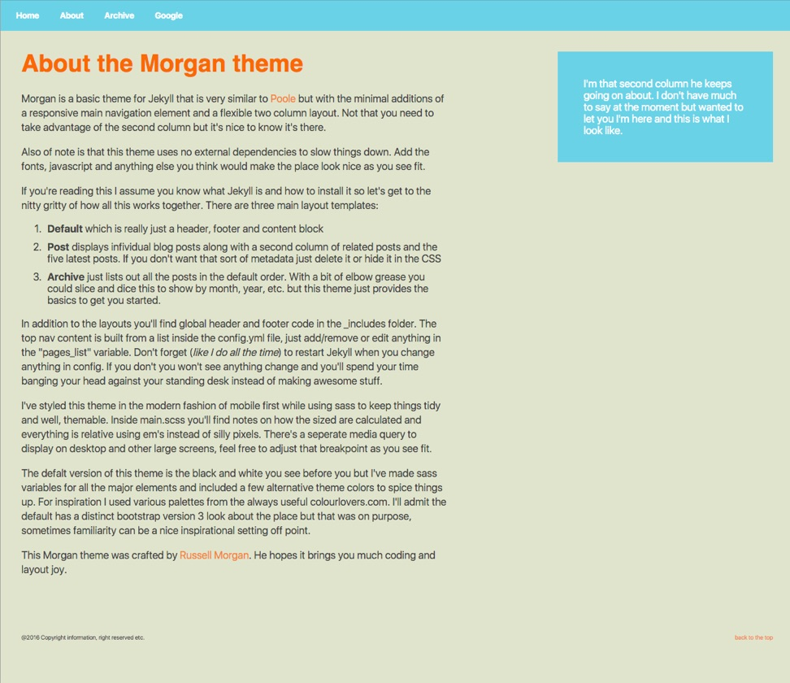

# Morgan
Morgan is a basic theme for Jekyll that is very similar to <a href="http://getpoole.com/">Poole</a> but with the minimal additions of a responsive main navigation element and a flexible two column layout. Not that you need to take advantage of the second column but it's nice to know it's there.

Also of note is that this theme uses no external dependencies to slow things down. Add the fonts, javascript and anything else you think would make the place look nice as you see fit.

If you're reading this I assume you know what Jekyll is and how to install it so let's get to the nitty gritty of how all this works together. There are three main layout templates:

1. **Default** which is really just a header, footer and content block
2. **Post** displays infividual blog posts along with a second column of related posts and the five latest posts. If you don't want that sort of metadata just delete it or hide it in the CSS
3. **Archive** just lists out all the posts in the default order. With a bit of elbow grease you could slice and dice this to show by month, year, etc. but this theme just provides the basics to get you started.

        
In addition to the layouts you'll find global header and footer code in the _includes folder. The top nav content is built from a list inside the config.yml file, just add/remove or edit anything in the "pages_list" variable. Don't forget (like I do all the time) to restart Jekyll when you change anything in config. If you don't you won't see anything change and you'll spend your time banging your head against your standing desk instead of making awesome stuff.

I've styled this theme in the modern fashion of mobile first while using sass to keep things tidy and well, themable. Inside main.scss you'll find notes on how the sized are calculated and everything is relative using em's instead of silly pixels. There's a seperate media query to display on desktop and other large screens, feel free to adjust that breakpoint as you see fit.
        
        
The defalt version of this theme is the black and white you see before you but I've made sass variables for all the major elements and included a few alternative theme colors to spice things up. For inspiration I used various palettes from the always useful colourlovers.com. I'll admit the default has a distinct bootstrap version 3 look about the place but that was on purpose, sometimes familiarity can be a nice inspirational setting off point.
<<<<<<< HEAD

**Included themes examples**

This Morgan theme was crafted by [Russell Morgan](https://github.com/russellmorgan). He hopes it brings you much coding and layout joy.

**Note:** This theme relies heavily on CSS flexbox and so it's not well suited for anyone trying to support IE9 and below.
